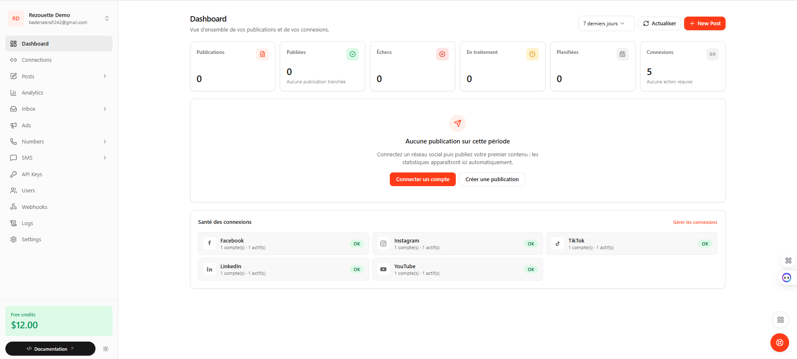
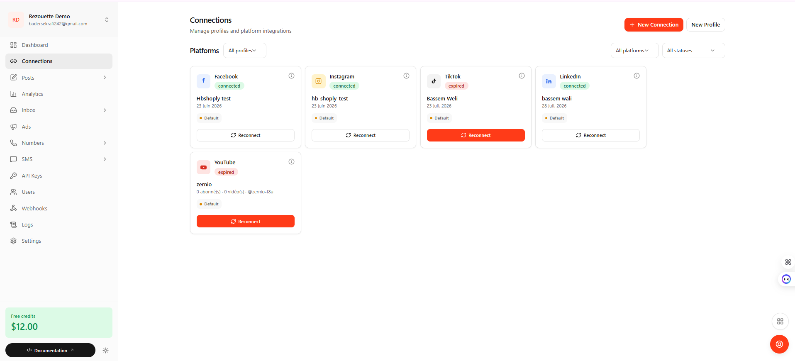
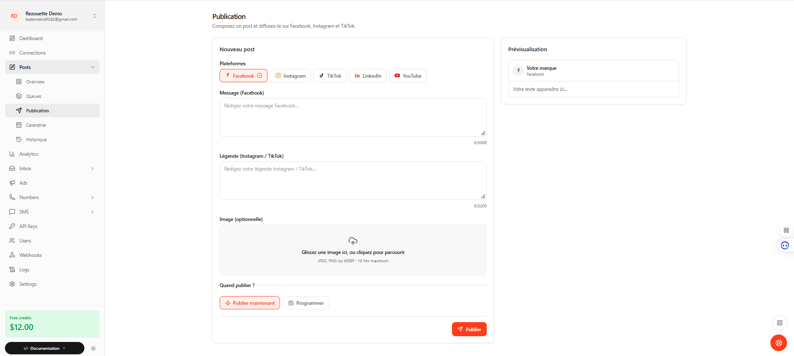
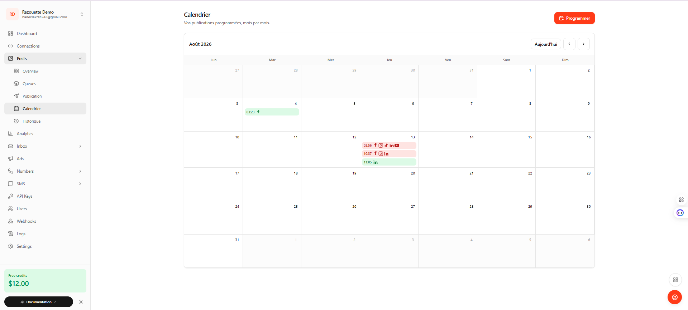
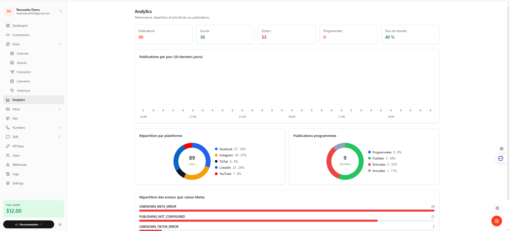
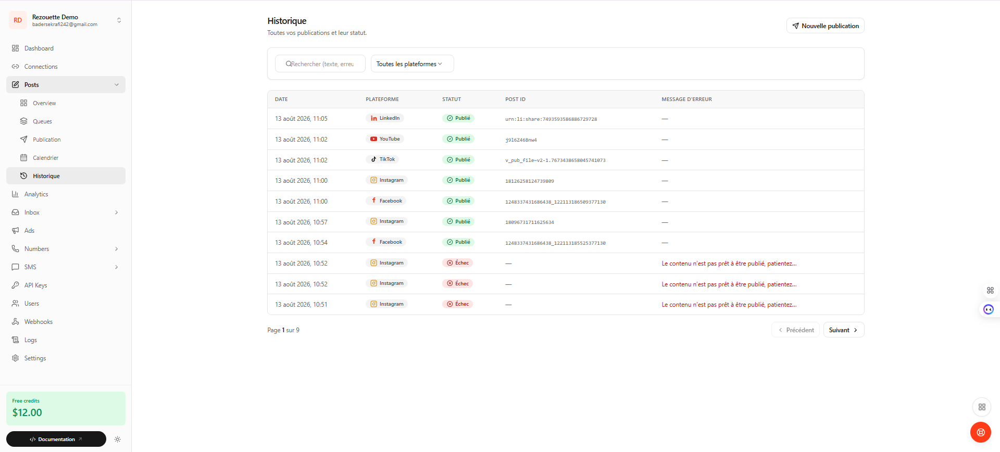

# Rezouette — Social Media Management SaaS 🚀

> Multi-platform social media management platform built with NestJS, Angular, Prisma and PostgreSQL.

**Rezouette** is a Full-Stack SaaS project designed to centralize social media account connections, content publishing, scheduling, publication monitoring and analytics from a single interface.

The platform integrates the Meta ecosystem and provides extensible implementations for TikTok, LinkedIn and YouTube.

---

## 🎯 Project Objectives

Rezouette provides a unified workspace to:

- Connect social media accounts through OAuth
- Manage multiple social platforms from one interface
- Publish content immediately
- Schedule future publications
- Manage images and videos
- Track publication status
- Monitor publishing queues
- Browse publication history
- Monitor account token status
- Visualize publishing activity and analytics
- Support additional social-media providers through an extensible architecture

---

## 🌐 Social Media Integrations

| Platform | Main Capabilities | Validation Status |
| --- | --- | --- |
| **Facebook Pages** | OAuth, text/image publishing, history, scheduling | ✅ Operational |
| **Instagram Business** | OAuth, image/caption publishing, history, scheduling | ✅ Operational |
| **TikTok** | OAuth + PKCE, video publishing, token refresh, scheduling | 🚧 Implemented — real-world validation pending |
| **LinkedIn** | OAuth/OIDC, text/link/image publishing, token monitoring, scheduling | 🧪 Implemented and tested with mocks |
| **YouTube** | OAuth + PKCE, multi-channel support, resumable upload and scheduling | 🧪 Implemented and tested with mocks |

> Some external integrations require real provider credentials, application approval and production validation before they can be enabled in a production environment.

---

## 🚀 Core Features

### 🔗 Social Account Connections

Rezouette provides OAuth-based social account connections and centralized account management.

The platform handles:

- Account connection
- OAuth callbacks
- Connected account information
- Provider-specific authentication flows
- Token lifecycle monitoring
- Reconnection requirements

---

### ✍️ Multi-Platform Publishing

Users can prepare content from a single interface and choose one or several target platforms.

Supported content depends on the provider:

- Text
- Images
- Videos
- Links
- Platform-specific publishing options

The backend isolates provider-specific implementations so that an error on one platform does not necessarily prevent the other selected platforms from being processed.

---

### 📅 Scheduled Publishing

Posts can be published immediately or scheduled for future execution.

```text
SCHEDULED
    ↓
PROCESSING
    ↓
PUBLISHED / FAILED / CANCELLED
```

Background schedulers detect due publications and route them through the corresponding provider workflow.

---

### 🗓️ Publication Calendar

The Angular interface provides a monthly calendar to visualize scheduled publications.

Users can:

- View upcoming posts
- Identify target platforms
- Inspect publication status
- Follow scheduled activity
- Cancel eligible scheduled publications

---

### 📚 Publication History

Rezouette keeps a persistent history of publication attempts.

Tracked information includes:

- Publication date
- Target platform
- Publication status
- Provider publication identifier
- Normalized error information

Typical publication states include:

```text
PENDING
PUBLISHED
FAILED
```

---

### 🔄 Token Lifecycle Management

The application monitors the state of connected provider tokens.

Possible states include:

```text
VALID
EXPIRING_SOON
EXPIRED
RECONNECT_REQUIRED
```

Token handling is adapted to the behavior of each social-media provider.

---

### 📊 Analytics

Rezouette provides a dashboard based on local publication history.

Available information includes:

- Total publications
- Successful publications
- Failed publications
- Scheduled publications
- Publishing success rate
- Distribution by platform
- Error distribution
- Daily publication activity

> Current analytics are based on Rezouette's own publication history and are not presented as real-time engagement metrics from every provider.

---

### 🧾 Swagger / OpenAPI

The backend exposes interactive API documentation with Swagger / OpenAPI.

It can be used to:

- Explore REST endpoints
- Inspect request DTOs
- Understand provider-specific APIs
- Test backend routes during development

---

## 🛠️ Tech Stack

### Backend

`NestJS 11` • `TypeScript` • `Prisma ORM` • `PostgreSQL`

`Swagger / OpenAPI`

### OAuth & Integrations

`OAuth 2.0` • `PKCE S256` • `OpenID Connect`

`HMAC-SHA256` • `JWKS / JOSE`

### Frontend

`Angular 21` • `TypeScript` • `RxJS`

`Angular Signals` • `TanStack Query` • `Reactive Forms` • `TailwindCSS`

### Testing & Development

`Jest` • `ts-jest` • `Git` • `GitHub`

---

## 🏗️ Architecture

The Rezouette backend follows **Clean Architecture** principles.

The goal is to keep business rules independent from frameworks, databases and external social-media providers.

```text
┌───────────────────────────────────────────────┐
│                 Angular 21                    │
│                  Frontend                     │
└───────────────────────┬───────────────────────┘
                        │
                        │ REST API
                        ▼
┌───────────────────────────────────────────────┐
│                  NestJS                       │
│                  Backend                      │
├───────────────────────────────────────────────┤
│                                               │
│   Presentation                               │
│   Controllers • DTOs • Swagger • Pipes       │
│                    │                          │
│                    ▼                          │
│   Application                                │
│   Use Cases • Services • Gateways            │
│                    │                          │
│                    ▼                          │
│   Domain                                     │
│   Entities • Repository Interfaces • Enums   │
│                    ▲                          │
│                    │                          │
│   Infrastructure                             │
│   Prisma • OAuth • Social APIs • Schedulers  │
│                                               │
└──────────────┬──────────────────────┬─────────┘
               │                      │
               ▼                      ▼
     ┌──────────────────┐    ┌──────────────────┐
     │   PostgreSQL     │    │ Social Providers │
     │     Prisma       │    │                  │
     └──────────────────┘    │ Facebook         │
                             │ Instagram        │
                             │ TikTok           │
                             │ LinkedIn         │
                             │ YouTube          │
                             └──────────────────┘
```

### Domain

Contains the core business concepts without depending on NestJS or external APIs.

Examples:

- Users
- Social accounts
- Publications
- Scheduled publications
- Repository interfaces
- Business enums

### Application

Contains the main application workflows:

- Connect social accounts
- Publish content
- Schedule publications
- Retrieve token status
- Upload media
- Generate analytics
- Reconcile asynchronous publications

### Infrastructure

Contains technical implementations:

- Prisma repositories
- PostgreSQL persistence
- Meta Graph API
- TikTok API
- LinkedIn API
- YouTube API
- OAuth / PKCE
- Local media storage
- Background schedulers

### Presentation

Contains the HTTP-facing layer:

- NestJS controllers
- DTO validation
- Swagger documentation
- Presenters
- HTTP error handling

---

## 🔐 OAuth & Security Engineering

### OAuth State Protection

OAuth flows use security mechanisms such as signed state values based on:

```text
HMAC-SHA256
```

with expiration and provider validation.

### PKCE

Supported integrations implement **PKCE S256**.

```text
code_verifier
      ↓
   SHA-256
      ↓
code_challenge
```

### One-Time OAuth Data

OAuth nonce and PKCE information are designed for one-time consumption with expiration.

### Controlled Media Access

The YouTube media pipeline only accepts media managed by the application instead of arbitrary remote resources.

---

## 🔵 Meta Integration

### Facebook Pages

Implemented capabilities include:

- OAuth connection
- Page discovery
- Text publication
- Image publication
- Scheduled publications
- Publication history

### Instagram Business

Implemented capabilities include:

- Account discovery
- Media container creation
- Image publication
- Caption support
- Scheduled publications
- Publication history

These represent the currently validated external social-media flows of the project.

---

## 🎵 TikTok Integration

The TikTok implementation includes:

- OAuth 2.0
- PKCE
- Video Direct Post workflow
- Refresh-token handling
- Token status monitoring
- Scheduled publications
- Publication status monitoring
- Angular integration

### Status

```text
Implementation:        ✅
Real-world validation: 🚧 Pending
```

---

## 💼 LinkedIn Integration

Implemented components include:

- OAuth 2.0
- OpenID Connect
- Signed OAuth state
- JWKS-based ID-token verification
- Member account persistence
- Token lifecycle monitoring
- Text publications
- Link publications
- Single-image publications
- Scheduled publications
- Publication history
- Error normalization
- Angular integration

### Status

```text
Implementation:             ✅
Unit tests with mocks:      ✅
Real LinkedIn OAuth:        ❌ Not yet validated
Real publication:           ❌ Not yet validated
Publishing enabled default: ❌ No
```

---

## 📺 YouTube Integration

The YouTube implementation includes:

- OAuth 2.0
- PKCE S256
- Multi-channel account support
- Token refresh workflow
- Resumable video upload architecture
- Chunk-based file reading
- Immediate publishing workflow
- Scheduled publishing workflow
- Processing reconciliation
- Publication history
- Angular integration

### Status

```text
Implementation:          ✅
Unit tests with mocks:   ✅
Real Google OAuth:       ❌ Not yet validated
Real video upload:       ❌ Not yet validated
Production validation:   ❌ Pending
```

---

## 🧪 Testing & Validation

The backend currently contains:

```text
48 backend test suites
783 passing tests
0 failing tests
```

Backend tests focus on unit-level behavior and mocked external dependencies.

Covered areas include:

- YouTube OAuth
- YouTube resumable upload logic
- YouTube processing reconciliation
- LinkedIn OAuth/OIDC
- OAuth state validation
- PKCE
- Schedulers
- Media storage
- Publication orchestration
- Prisma repositories
- Error mapping
- Analytics

### Verified Project Checks

```text
Prisma client generation     ✅
Prisma migration status      ✅
NestJS backend build         ✅
Backend Jest tests           ✅
Angular production build     ✅
```

### Frontend Testing

The current Angular project does not yet include an automated frontend test harness.

The production build validates TypeScript and Angular templates, while automated behavioral frontend tests remain part of future work.

---

## 🗄️ Database

Rezouette uses:

```text
PostgreSQL
    +
Prisma ORM
```

Database evolution is managed through versioned Prisma migrations.

Current documented state:

```text
10 Prisma migrations
```

Main persisted concepts include:

- Users
- Connected social accounts
- Social publications
- Scheduled publications
- Provider-specific status
- Media-related information

---

## 🖥️ Frontend

The active frontend is built with **Angular 21**.

Its feature-oriented structure combines:

```text
core/
shared/
layout/
features/
```

Main interfaces include:

- Dashboard
- Connected accounts
- Publication composer
- Publication calendar
- Publication history
- Analytics
- Settings

Angular Signals and TanStack Query are used for frontend and server-state management.

---

# 🖼️ Application Preview

## 📊 Dashboard

The main dashboard provides an overview of publication activity and connected social platforms.



---

## 🔗 Social Media Connections

Connected accounts can be managed from a centralized interface.

The interface displays Facebook, Instagram, TikTok, LinkedIn and YouTube account states and reconnection requirements.



---

## ✍️ Multi-Platform Publication

The publication composer allows content creation from one interface.

Users can select the target platforms, prepare provider-specific content, upload media and choose between immediate or scheduled publishing.



---

## 📅 Publication Calendar

Scheduled publications are visualized through a monthly calendar.

Platform indicators make it possible to quickly identify which social networks are targeted by each publication.



---

## 📈 Analytics Dashboard

The analytics interface provides publication KPIs, platform distribution, scheduled-post statistics and publishing error analysis.



---

## 📚 Publication History

The history interface tracks previous publication attempts with:

- Platform
- Publication date
- Status
- Provider publication ID
- Error information



> The screenshots represent the development/demo environment. Some provider integrations shown in the interface still require production credentials and real-world validation.

---

## 🎥 Demo

A complete demo video of the Rezouette platform is available.

The demonstration presents the main application flows, including:

- Social account management
- Multi-platform publishing
- Scheduling
- Publication calendar
- Publication history
- Analytics

<!-- Replace YOUR_DEMO_LINK when the video is uploaded or hosted -->

<!--
▶️ **[Watch the Rezouette Demo]([YOUR_DEMO_LINK](https://drive.google.com/file/d/1sUsT_SoCW7xMoSCSIlbmOnX9BkbYMIC6/view?usp=sharing))**
-->

---

## 📁 Public Repository Structure

```text
rezouette-social-media-saas/
│
├── backend/
│   └── NestJS application
│
├── frontend/
│   └── Angular application
│
├── images/
│   ├── dashboard.png
│   ├── connections.png
│   ├── publication.png
│   ├── calendar.png
│   ├── analytics.png
│   └── history.png
│
├── README.md
│
└── .gitignore
```

---

## 👨‍💻 Project Context

Rezouette is a personal software-engineering project focused on designing a scalable Full-Stack SaaS architecture and integrating external APIs.

The project allowed me to work on:

- Full-Stack application architecture
- Clean Architecture
- REST API development
- OAuth 2.0
- PKCE
- OpenID Connect
- Social-network API integrations
- Background schedulers
- Asynchronous processing
- PostgreSQL data modeling
- Prisma migrations
- Media-upload pipelines
- API error normalization
- API resilience
- Frontend / backend integration
- Automated backend testing

---

## ⚠️ Current Limitations

Rezouette is an actively developed engineering project and is not presented as a production-ready commercial SaaS.

Current limitations include:

- Application-level JWT authentication is not yet implemented
- A demonstration user identifier is currently used
- Multi-workspace / RBAC support is not yet implemented
- TikTok still requires real-world API validation
- LinkedIn requires real provider validation
- YouTube requires real provider validation
- OAuth temporary stores currently rely on process memory
- Multi-instance deployment is not yet supported for these temporary stores
- Tokens are not yet encrypted at rest
- Automated Angular tests are not yet configured

---

## 🗺️ Next Steps

Planned improvements include:

- Application authentication
- Multi-user support
- Role-based access control
- Real TikTok validation
- Real LinkedIn validation
- Real YouTube validation
- Token encryption at rest
- Distributed OAuth temporary storage
- Distributed scheduler locking
- Automated Angular tests
- Production deployment preparation

---

## 📌 Development Status

```text
Backend Architecture        ✅
Angular Frontend            ✅
PostgreSQL / Prisma         ✅
Facebook Integration        ✅
Instagram Integration       ✅
Scheduling                  ✅
Publication History         ✅
Local Analytics             ✅
Backend Automated Tests     ✅

TikTok Real Validation      🚧
LinkedIn Real Validation    🚧
YouTube Real Validation     🚧

Application Authentication ⏳
Production Deployment       ⏳
```

---

## 📬 Contact

**Bassem Wali**

- LinkedIn: [linkedin.com/in/bassem-wali](https://www.linkedin.com/in/bassem-wali)
- GitHub: [github.com/bassem2002](https://github.com/bassem2002)

---

## 📄 Disclaimer

This repository is a **portfolio-oriented public version** of the project.

External social-media integrations depend on third-party APIs, credentials, permissions and provider approval.

Features marked as mocked or pending validation should not be interpreted as production-validated integrations.
